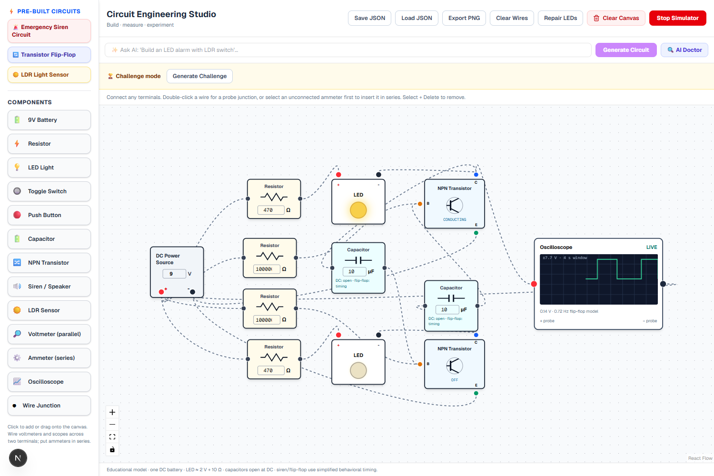
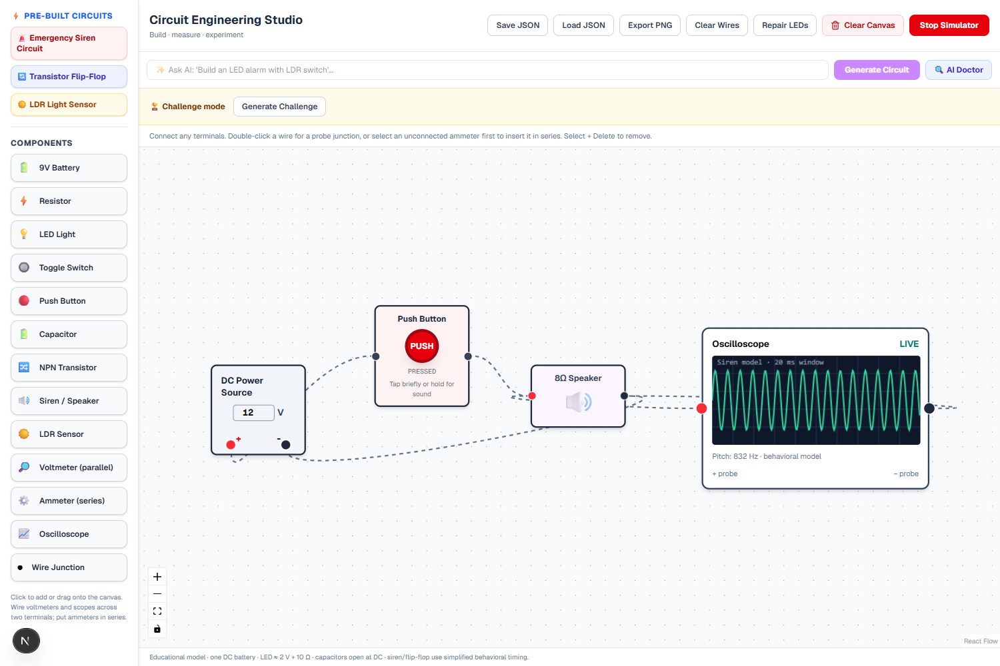
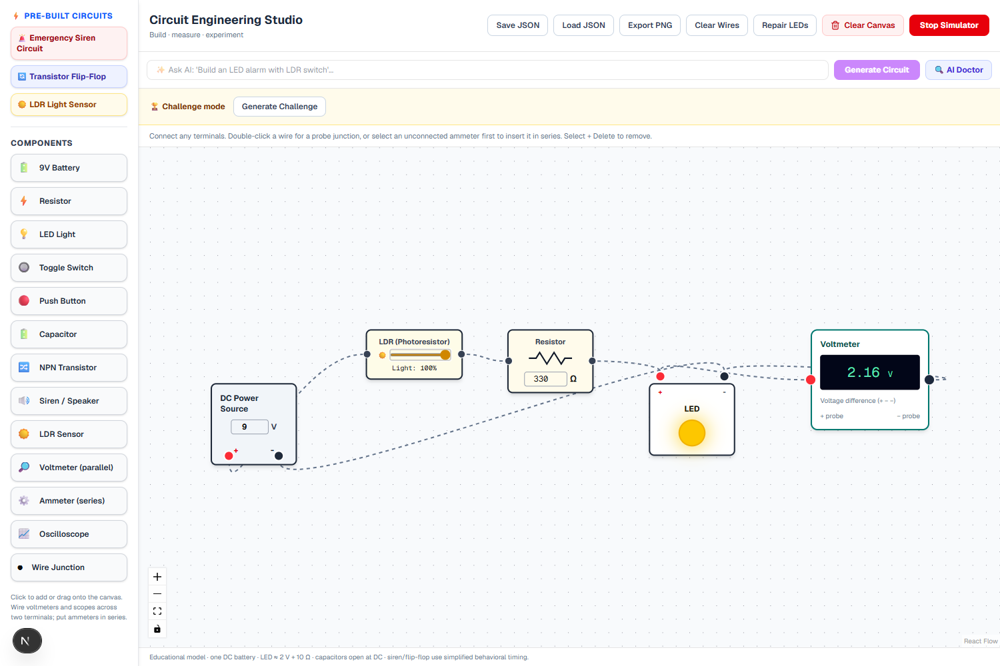
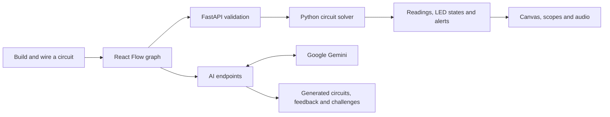

<div align="center">

# ⚡ Circuit Engineering Studio

**Build circuits. See the physics. Learn by experimenting.**

A browser-based electronics playground where you wire components, measure live signals, hear a siren, and learn with Gemini-powered circuit generation and challenges.


**Live demo: Coming soon** · [Run locally](#running-locally) · [Features](#features) · [Tech stack](#tech-stack)

<!-- Replace “Live demo: Coming soon” above with the public deployment URL when available. -->

</div>

## Screenshots

### The circuit workspace

A running transistor flip-flop with alternating LEDs and an oscilloscope, alongside the component library and AI controls.



<table>
  <tr>
    <th>Interactive siren</th>
    <th>Light-controlled LED</th>
  </tr>
  <tr>
    <td></td>
    <td></td>
  </tr>
  <tr>
    <td>Hold PUSH to raise the modeled pitch and hear the speaker.</td>
    <td>Adjust ambient light and observe the LED response.</td>
  </tr>
</table>

*Screenshots captured from the local application using its actual circuit solver.*

## Features

| Feature | What you can do |
| --- | --- |
| **Visual circuit builder** | Click or drag components onto a zoomable canvas, connect terminals, and edit component values. |
| **Live simulation** | Calculate terminal voltages and branch currents, toggle switches, press buttons, and change light levels. |
| **Overload feedback** | See unprotected LEDs explode and stay **BURNT**. Battery short circuits highlight faulty wires in red and stop simulation. |
| **Measurement tools** | Connect voltmeters, series ammeters, and oscilloscopes to inspect readings and waveforms. |
| **Prebuilt circuits** | Start with an emergency siren, transistor flip-flop, or LDR light sensor. |
| **Audible siren** | Tap PUSH for a short tone or hold it to increase the pitch using browser audio. |
| **AI circuit generation** | Describe a circuit in plain language and let Gemini generate an editable layout. |
| **AI Doctor** | Ask for feedback on the current circuit, informed by its wiring and simulation results. |
| **AI challenge mode** | Generate a wiring task, build your solution, and receive a score, feedback, and hints. |
| **Save and share** | Download and restore circuit JSON, or export the complete schematic as a clean PNG—even components outside the viewport. |
| **Clear with confirmation** | Reset the canvas through a confirmation modal to avoid accidentally losing progress. |

**Available components:** battery, resistor, LED, toggle switch, push button, capacitor, NPN transistor, speaker, LDR, voltmeter, ammeter, oscilloscope, and wire junction.

## Tech stack

| Layer | Technologies | Purpose |
| --- | --- | --- |
| **Frontend** | Next.js 16, React 19, TypeScript | App structure, interactive UI, and typed circuit data. |
| **Canvas** | React Flow (`@xyflow/react`) | Draggable components, terminal connections, pan, and zoom. |
| **Styling and UI** | Tailwind CSS 4, Base UI, Lucide React | Styling, accessible dialogs, and icons. |
| **Backend** | Python, FastAPI, Uvicorn, Pydantic | HTTP endpoints, validated requests, and simulation orchestration. |
| **Simulation** | Custom Python nodal DC solver | Voltages, branch currents, overload detection, and simplified switching models. |
| **AI API** | Google Gemini through `google-genai` | Circuit generation, analysis, challenge creation, and grading. |
| **Browser tools** | Web Audio API, Canvas API, `html-to-image` | Siren audio, waveform drawing, and PNG export. |
| **Development and checks** | npm, ESLint, TypeScript, Playwright, Python `unittest` | Dependency management, static checks, and regression tests. |
| **Configuration** | `python-dotenv` | Backend environment settings and API credentials. |

No database is required. Circuit files are saved as local JSON downloads; active AI challenges are stored in backend memory.

## How it works



1. **Build:** choose a template or place components and connect their terminals. Select a component or wire and press **Delete** to remove it.
2. **Simulate:** click **Start Simulator**. The frontend sends the electrical graph to the backend repeatedly while running; the solver returns measurements and component states.
3. **Experiment:** change resistance, battery voltage, switches, or light levels and watch the circuit respond. Use **Repair LEDs** after correcting an overload.
4. **Measure:** wire voltmeters and scopes across two terminals. Put an ammeter in series. Double-click a wire to create a junction, or select an unconnected ammeter before double-clicking to insert it into that wire.
5. **Learn and share:** request AI guidance, verify a challenge solution, save the layout as JSON, or export a schematic PNG.

The Gemini key stays on the backend. Manual building, simulation, measurement, and exports work without AI credentials.

## Running locally

### Prerequisites

- **Node.js 20.9 or newer** and npm.
- **Python 3.11** for the documented setup.
- **Git** to clone the repository.
- A **Gemini API key** if you want to use the AI features.
- A modern browser with Web Audio support.

### 1. Clone the project

```bash
git clone https://github.com/khalad007/circuit-simulator.git
cd circuit-simulator
```

### 2. Set up the backend

**Windows PowerShell** — from the repository root:

```powershell
cd backend
py -3.11 -m venv venv
.\venv\Scripts\python.exe -m pip install -r requirements.txt
Copy-Item .env.example .env
```

**macOS / Linux** — from the repository root:

```bash
cd backend
python3 -m venv venv
./venv/bin/python -m pip install -r requirements.txt
cp .env.example .env
```

For AI features, edit `backend/.env` and replace the placeholder:

```dotenv
GEMINI_API_KEY=your_gemini_api_key_here
GEMINI_MODEL=gemini-3.5-flash
```

`GEMINI_MODEL` is optional and defaults to the value above. Choose a model available to your Google project if the default is unavailable. If you already have a `.env`, edit it instead of copying over it. Keep this file private and restart the backend after changing it.

Start the backend in this terminal:

```powershell
# Windows PowerShell, inside backend/
.\venv\Scripts\python.exe -m uvicorn main:app --reload
```

```bash
# macOS / Linux, inside backend/
./venv/bin/python -m uvicorn main:app --reload
```

With the virtual environment activated, the equivalent command is `uvicorn main:app --reload`.

### 3. Start the frontend

Open a **second terminal** in the repository root:

```bash
cd frontend
npm ci
npm run dev
```

| Local service | URL |
| --- | --- |
| Circuit studio | [http://localhost:3000](http://localhost:3000) |
| Backend API docs | [http://127.0.0.1:8000/docs](http://127.0.0.1:8000/docs) |

Keep both terminals running. For a quick first experiment, load **Emergency Siren Circuit**, click **Start Simulator**, and tap or hold **PUSH**.

### 4. Build for production

From `frontend/`:

```bash
npm run build
npm start
```

The frontend production server still needs the FastAPI backend. For a local backend without development reload, run the same Uvicorn command without `--reload`.

### Development checks

From `frontend/`:

```bash
npm run lint
npx tsc --noEmit
npm run test:e2e
```

From the repository root:

```powershell
# Windows PowerShell
.\backend\venv\Scripts\python.exe -B -m unittest discover -s backend -p 'test_*.py'
```

```bash
# macOS / Linux
./backend/venv/bin/python -B -m unittest discover -s backend -p 'test_*.py'
```

The Playwright configuration uses headless **Microsoft Edge** and starts both development servers when needed. Its backend launch command currently targets the Windows virtual environment path; on macOS/Linux, adjust `frontend/playwright.config.ts` to use `../backend/venv/bin/python`. Browser checks exercise the real solver and stub AI responses where deterministic results are needed.

## Notes

### Simulation scope

This is an educational simulator with **one ideal DC battery**, not a SPICE replacement. LEDs use a simplified 2 V forward drop plus 10 Ω model; unprotected LEDs above 3.3 V can burn out. Capacitors are open in DC steady state. NPN transistors use a simplified voltage-controlled switch, while the siren and cross-coupled flip-flop use behavioral models. Full capacitor transients, transistor gain, base current, saturation, and breakdown are not modeled.

Flip-flop timing uses each side’s resistor and capacitor, approximately `0.693 × R × C` per half-cycle, bounded to 0.1–5 seconds for visualization. Voltmeters and scopes have infinite input impedance; ammeters use a 0.001 Ω shunt. Floating probes show no reading. The LDR template shows its LED as off below 0.5 mA, even when a meter detects small leakage current.

### Files and AI challenges

- A circuit supports up to **100 components and 300 wires**; JSON imports are limited to **2 MB**.
- JSON preserves layout, values, wires, viewport, and burnt LED state. Live measurement samples are not saved, and held pushbuttons are released on load.
- AI challenges expire after **one hour** or a backend restart. Grading can vary, and overloaded solutions are capped at 40 points.

### Troubleshooting and deployment

| Issue | What to check |
| --- | --- |
| AI cannot generate a circuit | Check `backend/.env`, restart FastAPI, and inspect the displayed error for key, model, or quota problems. |
| Simulation cannot connect | Confirm the backend is running on port 8000 and the frontend on port 3000. |
| Siren is silent | Start simulation before pressing PUSH, check system/tab volume, and interact with the page so the browser can enable audio. |
| LED remains burnt | Correct its wiring, add current-limiting resistance, then click **Repair LEDs**. |
| A deployed frontend cannot reach the API | The client currently targets `http://127.0.0.1:8000`. Before publishing, update the API URL in `frontend/lib/circuit.ts` and allowed CORS origins in `backend/main.py` for your HTTPS deployment. |

The public demo URL has not been configured in this README yet. Screenshots and local setup instructions are included so you can explore the project immediately.
